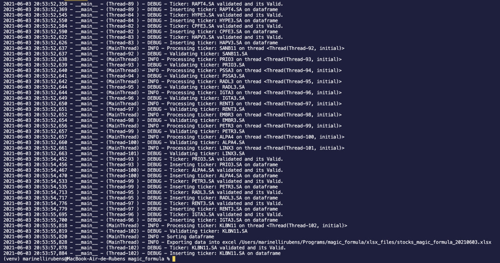
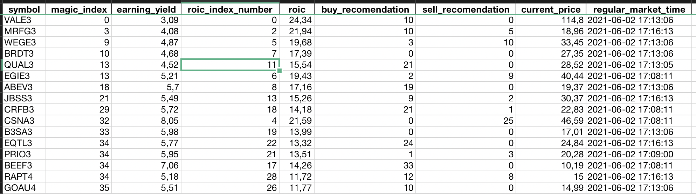

# Magic Formula
PROJETO ENCERRADO: Devido a muitos problemas com o yahoo finance eu decidi fazer uma nova versão usando as informações do status invest, vou criar um novo repositorio pois pretendo refazer do zero de uma forma mais simples.


[](https://opensource.org/licenses/Apache-2.0)
[](https://actions-badge.atrox.dev/marinellirubens/magic_formula/goto)


Projeto para usar a formula criada por Joel Greenblat no livro "The little book that beats the market" para analisar as acoes da Bovespa, **que fique claro que de forma alguma é uma recomendação de compra ou de venda, apenas um projeto pra auxiliar a analise**.

## Projeto
A ideia desse projeto é usar a formula do Joel Greenblat somado com algumas ideias propostas pelo Ramiro (Clube do Valor) para gerar uma planilha com as informações das ações mais baratas do indice IBRX100, outro proposito desse projeto é servir como um projeto para o meu portifolio como programador

```shell
$ magic_formula -V
MagicFormula v1.0.4
```

## Requerimentos
Para executar esse programa os seguintes requerimentos devem ser atendidos:
Versão do Python
```shell
$ Python 3.6.5
```
As seguintes libs são utilizadas:
```python
pandas==1.2.4
openpyxl==3.0.7
yahooquery
bs4==0.0.1
requests==2.25.1
numpy==1.20.2
pytest==6.2.4
pytest-cov==2.11.1
```
As libs estão todas listadas no requirements.txt e pode ser instalado usando o pip conforme abaixo:

### Diretamente
Devem ser instaladas as dependencias usando os seguintes comandos abaixo: 

Windows:
```bash
# criando o ambiente virtual
$ python -m venv venv
# Iniciando o ambiente virtual
$ .\venv\Scripts\activate.bat
# Instalando as dependencias
$ python -m pip install -r requirements.txt
```

Linux/Macos
```bash
# criando o ambiente virtual
$ python3 -m venv .venv
# Iniciando o ambiente virtual
$ source .venv/bin/activate
# Instalando as dependencias
$ python3 -m pip install -r requirements.txt
```

<!-- ### Usando o docker
Usando o arquivo docker-compose.yml pode ser criada a imagem com o comando abaixo:
```bash
docker-compose build
``` -->

## Instalação via pip
Tambem pode ser instalado via pip com o seguinte comando abaixo:
```shell
python3 -m pip install git+https://github.com/marinellirubens/magic_formula#egg=magic_formula==1.0.4
```

Ou usando o setup.py
```shell
python3 setup.py install
```


## Executando
Podem ser verificados os comandos de usando o argumento -h:
```shell
$ magic_formula -h
usage: main.py [-h] [-V] [-t THREADS] [-o OUTPUT_FOLDER] [-i INDEX [INDEX ...]] [-ll LOG_LEVEL] [-e EBIT] [-m MARKET_CAP] [-q QTY] [-d DATABASE] [-f FORMAT]
                             [-l LIST_TICKERS [LIST_TICKERS ...]] [-lf LIST_TICKERS_FILE] [-ri] [-gpl GRAHAM_MAX_PL] [-gpvp GRAHAM_MAX_PVP]

Parses command.

options:
  -h, --help            show this help message and exit
  -V, --version         Show program version
  -t THREADS, --threads THREADS
                        Max Number of threads
  -o OUTPUT_FOLDER, --output_folder OUTPUT_FOLDER
                        Path for output folder
  -i INDEX [INDEX ...], --index INDEX [INDEX ...]
                        Bovespa indexes (BRX100, IBOV, SMALL, IDIV, MLCX, IGCT, ITAG, IBRA, IGNM, IMAT, ALL) BRX100 - Indice IBRX100 IBOV - IBOVESPA SMALL - Indice de Small Cap IDIV - Indice de Dividendos    
                        MLCX - Indice de Mid-Large Cap IGCT - Indice de Governança Corporativa ITAG - Indice de Ações com Tag Along diferenciado IBRA - Indice Brasil Amplo IGNM - Indice de Governança
                        Corporativa - Novo Mercado IMAT - Indice de Materiais Basicos ALL - Todos os Indices anteriores
  -ll LOG_LEVEL, --log_level LOG_LEVEL
                        Log level
  -e EBIT, --ebit EBIT  Minimun ebit to be considered
  -m MARKET_CAP, --market_cap MARKET_CAP
                        Minimun market cap
  -q QTY, --qty QTY     Quantity of stocks to be exported.
  -d DATABASE, --database DATABASE
                        Send information to a database[POSTGRESQL].
  -f FORMAT, --format FORMAT
                        Format to be export [EXCEL, JSON].
  -l LIST_TICKERS [LIST_TICKERS ...], --list_tickers LIST_TICKERS [LIST_TICKERS ...]
                        List stocks instead of using the indexes.
  -lf LIST_TICKERS_FILE, --list_tickers_file LIST_TICKERS_FILE
                        List stocks file, a text file with a ticker by line.
  -ri, --roic_ignore    Option to ignore roic index and use only EY index
  -gpl GRAHAM_MAX_PL, --graham_max_pl GRAHAM_MAX_PL
                        Maximum pl for graham formula.[Default: 15]
  -gpvp GRAHAM_MAX_PVP, --graham_max_pvp GRAHAM_MAX_PVP
                        Maximum pvp for graham formula.[Default: 1.5]
```

O programa pode ser executado usando o seguinte comando
```bash
$ python3 magic_formula/main.py
```
Ou diretamente caso esteja instalado:
```bash
$ magic_formula 
```

<!-- Ou pode ser executado com o Docker usando o comando abaixo:
```bash
$ docker-compose up -d
``` -->

Esse comando ja esta contido nos arquivos run.sh(Linux e Macos) e run.cmd(Windows), pode ser observado abaixo o output do programa abaixo:



## Output
Como o objetivo desse programa é listar as ações por ordem de qual esta mais barata, um excel é exportado na pasta xlsx_files com o seguinte padrão de nome:
```
stocks_magic_formula_{yyyymmdd}_{INDEXES_NAMES}.xlsx
```
Exemplo de arquivo:


